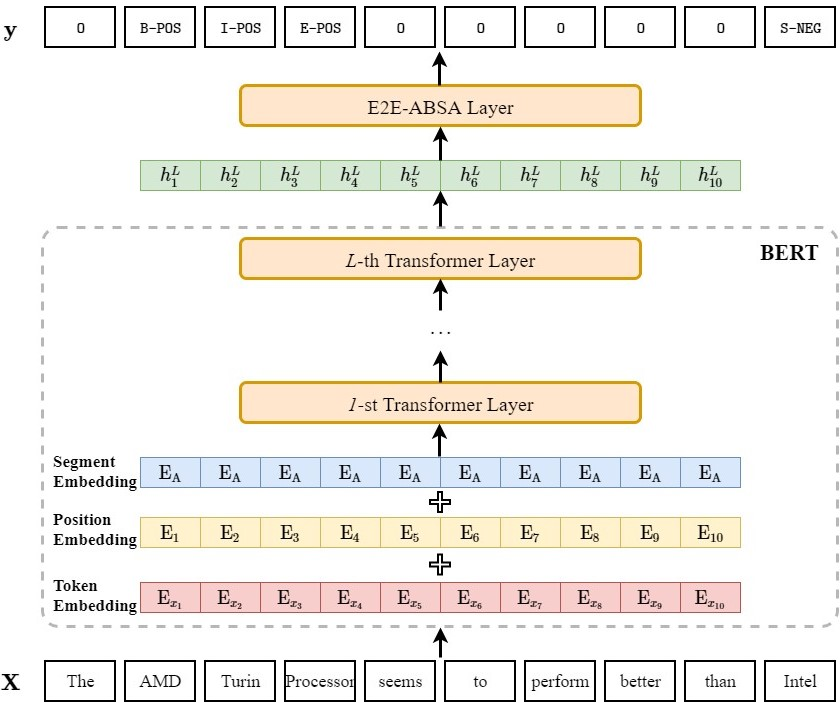

# BERT-E2E-ABSA
Exploiting **BERT** **E**nd-**t**o-**E**nd **A**spect-**B**ased **S**entiment **A**nalysis
<p align="center">
    
</p>

## Requirements
* python 3.7.3
* pytorch 1.2.0
* transformers 2.0.0
* numpy 1.16.4
* tensorboardX 1.9
* tqdm 4.32.1
* some codes are borrowed from **allennlp** ([https://github.com/allenai/allennlp](https://github.com/allenai/allennlp), an awesome open-source NLP toolkit) and **transformers** ([https://github.com/huggingface/transformers](https://github.com/huggingface/transformers), formerly known as **pytorch-pretrained-bert** or **pytorch-transformers**)

## Architecture
* Pre-trained embedding layer: BERT-Base-Uncased (12-layer, 768-hidden, 12-heads, 110M parameters)
* Task-specific layer: 
  - Linear
  - Recurrent Neural Networks (GRU)
  - Self-Attention Networks (SAN, TFM)
  - Conditional Random Fields (CRF)

## Dataset
* Restaurant: retaurant reviews from SemEval 2014 (task 4), SemEval 2015 (task 12) and SemEval 2016 (task 5)
* Laptop: laptop reviews from SemEval 2014


## Quick Start
* The valid tagging strategies/schemes (i.e., the ways representing text or entity span) in this project are **BIEOS** (also called **BIOES** or **BMES**), **BIO** (also called **IOB2**) and **OT** (also called **IO**). If you are not familiar with these terms, I strongly recommend you to read the following materials before running the program: 

  a. [Inside–outside–beginning (tagging)](https://en.wikipedia.org/wiki/Inside%E2%80%93outside%E2%80%93beginning_(tagging)). 
  
  b. [Representing Text Chunks](https://www.aclweb.org/anthology/E99-1023.pdf). 
  
  c. The [paper](https://www.aclweb.org/anthology/D19-5505.pdf) associated with project. 

* Reproduce the results on Restaurant and Laptop dataset:
  ```
  # train the model with 5 different seed numbers
  python fast_run.py 
  ```
* Train the model on other ABSA dataset:
  
  1. place data files in the directory `./data/[YOUR_DATASET_NAME]` (please note that you need to re-organize your data files so that it can be directly adapted to this project, following the input format of `./data/laptop14/train.txt` should be OK).
  
  2. set `TASK_NAME` in `train.sh` as `[YOUR_DATASET_NAME]`.
  
  3. train the model:  `sh train.sh`

* (** **New feature** **) Perform pure inference/direct transfer over test/unseen data using the trained ABSA model:

  1. place data file in the directory `./data/[YOUR_EVAL_DATASET_NAME]`.
  
  2. set `TASK_NAME` in `work.sh` as `[YOUR_EVAL_DATASET_NAME]`
  
  3. set `ABSA_HOME` in `work.sh` as `[HOME_DIRECTORY_OF_YOUR_ABSA_MODEL]`
  
  4. run: `sh work.sh`

## Environment
* OS: REHL Server 6.4 (Santiago)
* GPU: NVIDIA GTX 1080 ti
* CUDA: 10.0
* cuDNN: v7.6.1


## Citation
If the code is used in your research, please star our repo and cite our paper as follows:
```
@inproceedings{li-etal-2019-exploiting,
    title = "Exploiting {BERT} for End-to-End Aspect-based Sentiment Analysis",
    author = "Li, Xin  and
      Bing, Lidong  and
      Zhang, Wenxuan  and
      Lam, Wai",
    booktitle = "Proceedings of the 5th Workshop on Noisy User-generated Text (W-NUT 2019)",
    year = "2019",
    url = "https://www.aclweb.org/anthology/D19-5505",
    pages = "34--41"
}
```
     
